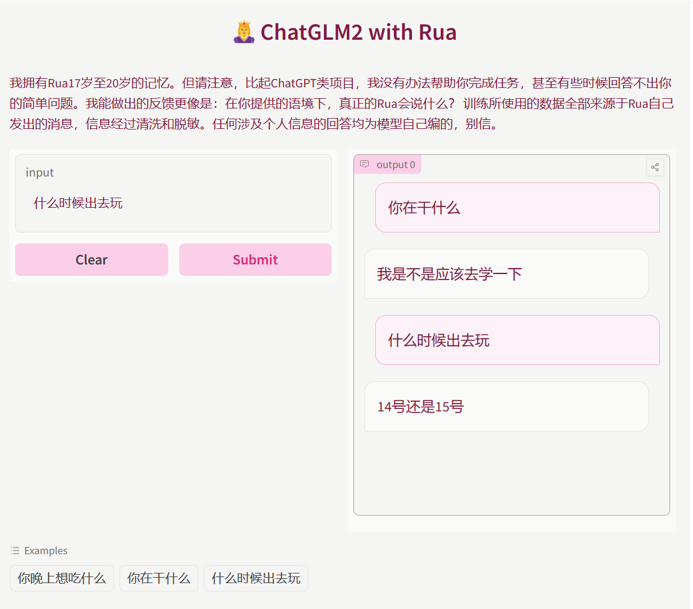

# ChatGLM2-With-Rua-Tutorial
**一个超级无敌保姆级教程：制作自己的数字克隆，0门槛0预算，可互动可分享。**  
---
**最低配置**：一台电脑，一个知道python是什么的脑子即可。**硬件方面不需要任何算力。**     
**灵感来自：[DK数字版](https://greatdk.com/1908.html#comment-5026)**   
下面是最终成品demo的截图。     
  
*（你肯定会做得比我好，因为我的聊天数据集质量不高，我目前才经历了3年“手机不会被妈妈收掉可以自由聊天”的生活。）*  
  
本项目以[ChatGLM2-6b](https://github.com/THUDM/ChatGLM2-6B)为起点。
## 制作数据集
我们需要大量由你直接产生的数据。收集途径因人而异，如果你想训练Chatbot，可以从微信/QQ聊天记录入手。如果你想训练上下文续写能力，可以从作文/演讲稿/博客入手。下面以收集微信聊天记录为例。  
### 使用工具
Github上有很多开源的微信聊天记录导出工具。下面以[留痕](https://github.com/LC044/WeChatMsg)为例。      
>如果有需要，可以在手机端通过`我-设置-通用-聊天记录迁移与备份  (v8.0.44)` 先把手机的聊天记录迁移到电脑上。     

在[这里](https://github.com/LC044/WeChatMsg/releases)下载最新的Release。请注意与微信版本的对应。  
右键点击刚刚下载的exe文件，以管理员身份运行，按照提示操作。此处具体操作步骤及问题请参阅[“留痕”使用教程](https://blog.lc044.love/post/5)。  
如果我们成功导出所有的聊天数据，可以在当前目录的`data/聊天记录` 下找到一个`messages.csv` 文件。之后我们只需要用到这个。   
### 数据处理
本段内容适配版本：[留痕](https://github.com/LC044/WeChatMsg) == **0.2.6** 微信PC端 == 3.9.8.15，**使用新版本的朋友请务必自行修改`build_dataset.ipynb` ，如果需要帮助可以开issue！**  
**注意：[留痕](https://github.com/LC044/WeChatMsg) >= 0.2.7 中表头包含发送人昵称、备注，如0.2.7版本中表头为`localId,TalkerId,Type,SubType,IsSender,CreateTime,Status,StrContent,StrTime,Remark,NickName,Sender`, 列数与内容已经对齐。**  
（要是我晚两天做就好了啊啊啊这样就方便多了也不会因为多个备份的talkerId不一样而乱掉了呜呜呜呜😭）  
`messages.csv`的形式如下：
```
localId,TalkerId,Type,SubType,IsSender,CreateTime,Status,StrContent,StrTime
12245,3,1,0,1,1528935478,,如果有帮助的话,2013-11-04 21:51:18,1234567890987654
12246,3,1,0,1,1572875478,,给我点个Star好不好😗,2019-11-05 22:47:11,123987654987654
```
先在第一行的末尾再加一个列名，使得每一列对齐，方便读入。  
```
localId,TalkerId,Type,SubType,IsSender,CreateTime,Status,StrContent,StrTime,_
```
这里我们只需要`TalkerId, Type, SubType, IsSender, StrContent` 这几列。通过我的观察，你本人发送的信息满足`Type=1, SubType=0, IsSender=1` 。如果前后两行在同一个聊天里，它们的`TalkerId`也是相同的。    
接下来我们需要清洗数据并制作数据集。参考[ChatGLM2-6b](https://github.com/THUDM/ChatGLM2-6B)官方的训练示例，数据集格式应该长这个样子，`content`是问，`summary`是答：  
```
{"content": "我会成为厉害的人吗", "summary": "肯定会的"}
{"content": "你喜欢Rua吗", "summary": "好喜欢♥♥"}
```
一个简单的实现可以在上面的`build_dataset.ipynb`找到。这个文件的功能包括：drop掉所有内容为空的消息；统计总消息数；按照`TalkerId`排序；找到所有你发送的长度大于5个字符的文本消息；找到它们的上一条；统计最终可用的消息数；生成需要的json文件。你可以根据需要自行修改。  
之后我们就得到了两个文件：`train.json`和`dev.json`。这就是我们所需要的训练数据。    
## 开始训练
大模型对显存的要求比较高，`ChatGLM2-6b-int4`是一个降低显存的解决方案。使用Kaggle的两块Tesla T4时，每块占用8G显存。    
Kaggle免费方案提供每周30小时的双卡T4，可以充裕地满足我们的训练要求，因此这里以在Kaggle上运行为例。如果你有更好的硬件或者购买在线资源的运算，也可以进行参考。  
本段参考了[这篇博客](https://blog.csdn.net/qq_72632426/article/details/130898002)。  
首先我们下载[ChatGLM2-6b](https://github.com/THUDM/ChatGLM2-6B)。  
```
git clone https://github.com/THUDM/ChatGLM2-6B.git
```
clone好了之后进入`ChatGLM2-6B/ptuning` 文件夹，新建一个文件夹`WechatMsg`，把刚刚的`train.json`和`dev.json`放在下面。（当然你也可以随便指定路径，只要把这两个文件放进去就行。）  
然后我们要按需要`train.sh`文件。具体如何修改请参考上面的`train.sh` 文件，有详细注释。  
一切就绪，点击[这里](https://www.kaggle.com/)前往kaggle。前置知识：  
1. 如何创建一个Kaggle账号。
2. 如何上传自己的数据集。
3. 如何新建一个Kaggle笔记本、关联自己的数据集并开启GPU加速。

这些都可以非常方便地在网上学习到（比如[这里](https://blog.csdn.net/qq_53919099/article/details/130867160)）。  
一个训练笔记本的例子是上面的`kaggle-train.ipynb`，请阅读注释，根据自己的实际文件名填空。  
我们需要上传整个`ChatGLM2-6B`文件夹到自己的数据集，添加到笔记本，开启GPU T4 * 2。  
如果你看到`!bash train.sh` 的输出进入下面的阶段，就是开始训练了。  
```
·····
le set os.environ["WANDB_DISABLED"] = "true"
wandb: WARNING Path ···· wasn't writable, using system temp directory.
wandb: WARNING Path ···· wasn't writable, using system temp directory
wandb: Tracking run with wandb version 0.16.1
wandb: W&B syncing is set to `offline` in this directory.  
wandb: Run `wandb online` or set WANDB_MODE=online to enable cloud syncing.
{'loss': 6.2631, 'learning_rate': 0.0199, 'epoch': 0.0}                         
{'loss': 5.1531, 'learning_rate': 0.0198, 'epoch': 0.0}                         
{'loss': 4.902, 'learning_rate': 0.0197, 'epoch': 0.01} 
····
```
训练结束以后（或者进行到一定阶段），可以在右边output一栏层层剥开文件夹找到`checkpoint-{number}`的文件夹。点开保存里面的pytorch_models.bin，我们只需要这一个文件。  
## 自己测试
还是利用kaggle。新建一个自己的数据集，上传刚刚下载的pytorch_models.bin文件。新建一个笔记本并关联这个数据集。一个测试笔记本的例子是上面的`kaggle-test.ipynb`，请阅读注释，根据自己的实际文件名填空。你可以根据实际情况上传不同参数、不同训练阶段和不同数据集产生的结果，并挑选表现最好的保留。炼丹🐒🐒🐒    
注意下面这个函数：  
``` 
response, history = model.chat(tokenizer, "你好!", history=[])
```
可以向函数中添加`temperature`参数来调整输出的风格，数值越小越precise，越大越creative。  
由于我们下一步是制作可以分享的网页版本，因此这里的硬件选择了CPU。同样的，如果你有更好的硬件或者购买在线资源的运算，可以随意指定。
## 分享给朋友玩
有很多方法可以写前端，也可以买服务器买域名，但是秉持着0预算的前提，这里以Hugging Face🤗免费方案为例。Hugging Face🤗免费方案提供16G内存CPU，足够进行测试了。
点击[这里](https://huggingface.co/)前往Hugging Face🤗前置知识：  
1. 如何创建一个Hugging Face🤗账号。
2. 如何新建一个Hugging Face Space。（类似于Github Repository）
   
这些都可以非常方便地在网上学习到（比如[这里](https://www.kdnuggets.com/2023/06/build-ai-chatbot-5-minutes-hugging-face-gradio.html)）。
我们新建一个Hugging Face Space，在提示选择SDK时选择Graddio。其中关键的文件有3个，分别是`app.py`,`requirements.txt`和你最后选择的`pytorch_model.bin`。
请新建`requirements.txt`并填入如下内容：
```
torch
transformers
sentencepiece
cpm_kernels
```
`app.py`即编写最后呈现出来的页面，因此可以随意编写。demo中使用的`app.py`及详细讲解注释可以在上面找到。    
你的朋友在浏览器输入`https://huggingface.co/spaces/{your-user-name}/{your-space-name}`就可以跟你的数字分身说话了。
